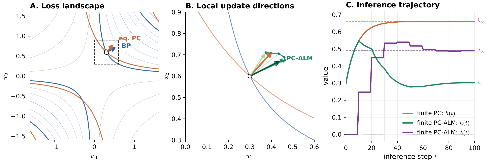

# PC-ALM



> **PC-ALM** aligns local predictive-coding updates with backpropagation by
> accumulating layer-local constraint errors in Lagrange multipliers.

Official JAX reference implementation of
**Augmented Lagrangian Predictive Coding**.

[](https://arxiv.org/abs/2605.31022)
[](https://pub.sakana.ai/pc-alm/)

This minimal reference covers the paper's residual MLP width/depth grid on MNIST and
Fashion-MNIST, with BP, PC, and PC-ALM on the same architecture. It uses the
paper's fixed `gamma0=1` parameterization.

## Installation

Run from a source checkout. Install
[uv](https://docs.astral.sh/uv/getting-started/installation/), then:

```bash
uv sync
```

To run the test suite:

```bash
uv sync --extra test
uv run pytest
```

For NVIDIA GPUs, install a matching [JAX CUDA build](https://docs.jax.dev/en/latest/installation.html#nvidia-gpu)
with `uv pip install` after syncing. Use `uv run --no-sync` for the commands below
to preserve that build.

## Data

The synthetic smoke test does not require downloaded data:

```bash
uv run python train.py --config configs/smoke.yaml
```

Download MNIST and [Fashion-MNIST](https://github.com/zalandoresearch/fashion-mnist)
from the repository root:

```bash
mkdir -p data/MNIST/raw data/FashionMNIST/raw
for file in train-images-idx3-ubyte train-labels-idx1-ubyte \
            t10k-images-idx3-ubyte t10k-labels-idx1-ubyte; do
  curl -fL "https://storage.googleapis.com/cvdf-datasets/mnist/${file}.gz" \
    -o "data/MNIST/raw/${file}.gz" || break
  curl -fL "https://raw.githubusercontent.com/zalandoresearch/fashion-mnist/master/data/fashion/${file}.gz" \
    -o "data/FashionMNIST/raw/${file}.gz" || break
done
```

Both uncompressed IDX files and `.gz` IDX files are supported. Use `--data-dir`
to point to another directory containing `MNIST/raw/` and `FashionMNIST/raw/`.

## Training

Reproduce one Fashion-MNIST cell: width `N=32`, depth `L=32`, ReLU, seed 0,
one epoch on the full dataset, and inference budget `T=2L`:

```bash
uv run python scripts/run_headline_grid.py --config configs/headline_fashion.yaml \
  --widths 32 --depths 32 --activations relu --seeds 0 --methods bp,pc,pcalm \
  --budget-rule 2L --state-lr-table configs/eta_best_by_cell.csv \
  --output-dir results/repro_fashion_n32_l32 --data-dir data
```

Expected results (CPU reference run; small numerical differences are normal):

| Method | Test accuracy | Gradient cosine to BP |
|---|---:|---:|
| BP | 78.66% | 1.000 |
| PC | 68.13% | 0.604 |
| PC-ALM | 77.75% | 0.909 |

`configs/eta_best_by_cell.csv` contains the paper's frozen activity step sizes
(`eta_h = 1/lambda_max`, median over seeds) for each dataset/activation/width/depth.
For custom runs, edit a YAML config or use `uv run python train.py --help` for
single-run options.

<details>
<summary>Full Fashion-MNIST grid (675 runs)</summary>

```bash
uv run python scripts/run_headline_grid.py --config configs/headline_fashion.yaml \
  --widths 8,16,32,64,128 --depths 8,16,32,64,128 \
  --activations linear,tanh,relu --seeds 0,1,2 --methods bp,pc,pcalm \
  --budget-rule 2L --state-lr-table configs/eta_best_by_cell.csv \
  --output-dir results/headline_fashion --data-dir data
```

</details>

Use `configs/headline_mnist.yaml` for MNIST.

## Evaluation

Each run writes:

```text
results/path-to-run/
  config.json
  metrics.csv
  summary.json
```

For grid runs, `cells.csv` summarizes all methods and seeds. A compact heatmap
can be generated with:

```bash
uv run python scripts/plot_headline_grid.py \
  --input results/repro_fashion_n32_l32/cells.csv \
  --output results/repro_fashion_n32_l32/gain_pcalm_minus_pc.png \
  --activation relu
```

Use the full grid's `cells.csv` for a heatmap across widths and depths.

## Citation

If you use this code, please cite:

```bibtex
@misc{seely2026pc-alm,
  title         = {Augmented Lagrangian Predictive Coding},
  author        = {Jeffrey Seely and Julian Gould},
  year          = {2026},
  eprint        = {2605.31022},
  archivePrefix = {arXiv},
  primaryClass  = {cs.LG},
  url           = {https://arxiv.org/abs/2605.31022},
}
```

## License

This project is released under the MIT License.
