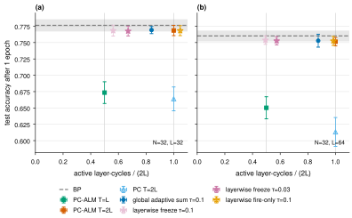

# Layer-local update timing for Augmented Lagrangian Predictive Coding

Research code and results for replacing the fixed inference budget in **PC-ALM**
(*Augmented Lagrangian Predictive Coding*, Seely and Gould, Sakana AI,
[arXiv 2605.31022](https://arxiv.org/abs/2605.31022)) with a trigger that each layer computes
from its own Lagrange multiplier and residual. The official JAX implementation
([SakanaAI/pc-alm](https://github.com/SakanaAI/pc-alm), MIT) is vendored under `pcalm/` and
extended; the paper's algorithm is reproduced exactly by the new code when the trigger is disabled
(unit-tested).

## Result in one table

Fashion-MNIST, ReLU residual MLPs with the paper's mean-field parameterisation and frozen
step sizes, 3 seeds. Compute is the fraction of the paper's fixed `T = 2L` schedule; "executed"
counts (layer, cycle) pairs in which a layer actually computed.

| Method | Accuracy vs PC-ALM at T = 2L | Executed compute | Where |
|---|---|---|---|
| PC-ALM at T = L (the paper's half budget) | about 10 points lower | 0.50 | phase 1 |
| Global credit trigger | matched | 0.84 to 0.88 | phase 1 |
| Per-layer **freeze-and-fire** | matched at 1 and 5 epochs | 0.49 (L=64), 0.56 (L=32) | phase 2 |
| Freeze-and-fire + **wavefront gate** | matched, identical numerics | **0.21 (L=64), 0.13 (L=128)** | sparse |




Wall-clock on an Apple M4 Max CPU follows executed compute once matmuls dominate: the wavefront
gate runs in 0.61x the dense fixed schedule at width 512, breaks even at 128, and is slightly
slower at 32 where per-layer dispatch dominates. The executed fraction is the hardware-independent
number.

## The method in three sentences

1. Every hidden layer watches the composite credit `g_i = lambda_i + rho * r_i`, the quantity its
   own weight update consumes. When `||g_i||` is nonzero and its relative change stays below
   `tau` for three consecutive cycles, the layer **fires**: it snapshots `g_i` for its weight
   update and stops taking inference steps. The loop ends when every layer has fired.
2. Fire times are linear in layer index from the output side to the input side, at 1.75 cycles
   per layer against the paper's linear-theory wave speed of 2.03. That is the paper's
   "ballistic credit propagation" measured layer by layer in a ReLU network, and it is what makes
   the saving predictable.
3. Before the wave reaches a layer its activity equals the forward pass and its multiplier is
   zero, so its gradient is exactly zero. The **wavefront gate** skips those steps too; the
   result is bit-for-bit the same and the executed compute falls to 13 to 21%.

A global version of the trigger (phase 1) fires at the same step on every batch, about
`0.85 L / sqrt(alpha eta_h)`, so it only rediscovers that `T = 2L` over-provisions by 15 to 20%.
The per-layer version is where the saving is.

Full write-ups with figures, tables, and caveats:
`reports/adaptive-budget-phase1/`, `reports/adaptive-budget-phase2/` (freeze-and-fire, the
5-epoch check, the sparse implementation, the L = 128 cell). Design documents: `docs/design/`.

## Running it

```sh
uv sync --extra test
uv run pytest -q                      # 51 tests, incl. exact reproduction of the paper's algorithm

# data: MNIST / Fashion-MNIST IDX files under <data>/MNIST/raw and <data>/FashionMNIST/raw
# (download commands as in the upstream pc-alm README)

# the default configs/run.yaml is the wavefront example: N=32, L=64, 3 seeds, 1 epoch
uv run python scripts/run_node.py --config configs/run.yaml --data-dir <data> --output-root results

# any other cell or method
uv run python scripts/make_node_config.py --width 32 --depth 128 --method pcalm_layerwise_sparse --gate wavefront --tau 0.1 --t-max 3L
uv run python scripts/make_node_config.py --width 32 --depth 64  --method pcalm --budget 2L      # the paper's schedule

# CPU timing sweep (dense vs masked vs sparse, widths 32/128/512 at L=64, plus L=128)
uv run python scripts/run_node.py --config configs/timing.yaml --output-root results
```

Methods: `bp`, `pc`, `pcalm` (paper), `pcalm_adaptive` (global trigger), `pcalm_layerwise`
(freeze-and-fire, dense masked), `pcalm_layerwise_sparse` (real skipping; `--gate freeze` or
`--gate wavefront`). Each run prints `RESULT` lines and writes `summary.json`, per-layer fire
times, and per-batch step counts.

## Layout

- `pcalm/inference.py` all inference variants; `pcalm/timing.py` the timing harness;
  `pcalm/training.py`, `pcalm/model.py`, `pcalm/data.py` as upstream plus logging.
- `scripts/run_node.py` single entry point; `scripts/make_node_config.py` writes `configs/run.yaml`.
- `tests/` exact-reproduction and invariance tests.
- `reports/` the phase reports, every figure with the script that made it, and
  `reports/data/all-nodes-aggregate.csv` (one row per experiment, mean and std over seeds).
- `docs/design/` the three design documents (global trigger, freeze-and-fire, sparse).

The `dense-experiments-phase1-2` branch is the state of the code before the sparse
implementation, kept for reading the freeze-and-fire logic without the `lax.cond` machinery.
The experiments were run as a tree of 51 nodes with OpenResearch; per-seed outputs are summarised
in `reports/data/`.

## Credit and license

The model, data, and training code and the PC-ALM algorithm are from Seely and Gould's
[pc-alm](https://github.com/SakanaAI/pc-alm) (MIT, see `LICENSE` and `CITATION.cff`). The
adaptive, layer-wise, and sparse methods, the timing harness, the tests, and the reports are
additions in this repository, released under the same MIT license. Please cite the original
paper for PC-ALM itself.
