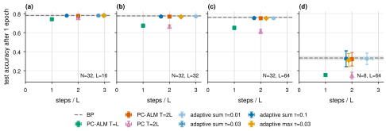
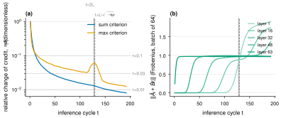

# Adaptive inference budget for PC-ALM, phase 1: a global credit-stability trigger

Date: 2026-09-14. Project: Augmented Lagrangian Predictive Coding (Seely and Gould, arXiv 2605.31022).
Code: vendored official JAX implementation plus the `pcalm_adaptive` method (experiment tree, 32 nodes, 3 seeds each).

## Question

Algorithm 1 of the paper updates the weights after a fixed number `T` of primal-dual inference
cycles, with `T = 2L` in the headline results. Can the weight update instead be triggered by the
quantities already present in the loop, the multipliers `lambda_i` and the residuals `r_i`, and
does that save compute or improve accuracy?

## Method

After every cycle we form the composite credit `g_i = lambda_i + rho r_i` (the signal the weight
update consumes) and its batch relative change

- sum criterion: `delta_t = sum_i ||g_i(t) - g_i(t-1)|| / sum_i ||g_i(t)||`
- max criterion: `delta_t = max_i ||g_i(t) - g_i(t-1)|| / max_i ||g_i(t)||`

The loop stops, and the weight update fires, when `delta_t < tau` for 3 consecutive cycles,
`t >= 2`, and the input-side credit has reached 10% of the output-side credit (arrival guard).
Hard cap `t_max = 3L`. With `tau = 0` this reproduces the paper's algorithm exactly (unit test).

Setup as in the paper: Fashion-MNIST, ReLU residual MLP with mean-field parameterisation, Adam,
the paper's frozen per-cell `eta_h`, `rho = alpha = 1`, batch 64, one epoch, 3 seeds. Cells
(N, L) = (32, 16), (32, 32), (32, 64), (8, 64). Baselines: BP, PC at `T = 2L`, PC-ALM at `T = L`
and `T = 2L`. Adaptive variants: sum criterion with `tau in {0.01, 0.03, 0.1}`, max criterion
with `tau = 0.03`.

## Results

**Figure 1.** Test accuracy after one epoch against mean inference steps per batch in units of
depth. Mean of 3 seeds, error bars one standard deviation in both axes. BP is the dashed line.
Full table: `data/results-table.csv`.

| Cell (N, L) | PC-ALM T=2L | adaptive sum tau=0.1 | steps saved | adaptive sum tau=0.01 | adaptive max tau=0.03 |
|---|---|---|---|---|---|
| (32, 16) | 77.6 ± 0.8 @ 2.00L | 77.9 ± 0.8 @ 1.56L | 22% | 78.0 ± 0.8 @ 3.00L | 77.9 ± 0.7 @ 2.96L |
| (32, 32) | 76.9 ± 0.8 @ 2.00L | 76.9 ± 0.5 @ 1.68L | 16% | 77.0 ± 1.0 @ 3.00L | 76.6 ± 0.8 @ 2.44L |
| (32, 64) | 75.1 ± 0.6 @ 2.00L | 75.3 ± 1.0 @ 1.75L | 12% | 75.2 ± 0.8 @ 2.49L | 75.1 ± 0.6 @ 2.21L |
| (8, 64)  | 32.0 ± 7.1 @ 2.00L | 32.6 ± 8.3 @ 1.78L | 11% | 32.5 ± 6.0 @ 2.57L | 31.1 ± 6.9 @ 1.87L |

Accuracies in percent, mean ± std over 3 seeds; `@` gives mean inference steps per batch in
units of `L`. Reference points: BP reaches 78.1 / 77.6 / 76.0 / 33.3 in the four cells; PC at
`T = 2L` reaches 75.6 / 66.4 / 61.3 / 15.0; PC-ALM at `T = L` reaches 74.1 / 67.4 / 65.0 / 15.4.
The (8, 64) cell is near chance for every method including BP after one epoch and is not
informative about accuracy differences; it is kept because the trigger timing is still meaningful
there.

### Finding 1: matched accuracy with 11 to 22% fewer inference steps

`tau = 0.1` with the sum criterion matches the `T = 2L` accuracy within one standard deviation
in every cell (its mean is equal or higher in all four) while using 1.56L to 1.78L inference
steps instead of 2L. It is the only setting in the sweep that never costs more than `2L`. The
paper's own PC-ALM at `T = L` shows what the alternative fixed saving costs: 3 to 10 points of
accuracy at N = 32.

### Finding 2: the trigger discovers a per-architecture constant, not a per-batch schedule

Across the 937 batches of an epoch the stop step barely moves: standard deviation across seeds
of the per-run mean is 0.003 steps at (32, 64) and the per-batch values stay within one step
(54 at the start of training, 53 at the end, at (32, 32)). The stopping time is set by the
arrival guard, i.e. by when the credit wave reaches the input layer, which the paper's
Appendix D predicts at `t_infl = L / sqrt(alpha eta_h)`. Measured arrival is a fixed fraction
of that prediction:

| L | predicted `t_infl` | measured stop (tau=0.1) | ratio |
|---|---|---|---|
| 16 | 33.7 | 25.0 | 0.74 |
| 32 | 65.9 | 53.7 | 0.81 |
| 64 (N=32) | 129.6 | 112.0 | 0.86 |
| 64 (N=8) | 130.7 | 113.9 | 0.87 |

This is a non-linear (ReLU) confirmation of the linear wave picture, and it says the practical
content of phase 1 is: **T ≈ 1.7L is enough; 2L over-provisions by 15 to 20%.** A per-batch
adaptive mechanism buys nothing beyond that at the global level, because the arrival time does
not depend on the data or on the training state.

### Finding 3: tighter convergence of the credit raises BP alignment but not accuracy

**Figure 2.** (a) Sum and max criteria against inference cycle at initialisation for the
(32, 64) cell, seed 0, one batch of 64; dotted lines are the three `tau` values, vertical lines
mark `t = 2L` and the predicted inflection. (b) Frobenius norm of the composite credit at five
layers; the wave travels from the output side (layer 63) to the input side (layer 1).

The gradient cosine to BP increases monotonically with steps (at (32, 64): 0.85 at 1.75L, 0.92 at
2L, 0.94 at 2.2L, 0.95 at 2.5L), yet test accuracy is flat from 1.56L upward in every cell.
Panel (b) shows why more steps keep changing the gradient: after the wave reaches layer 1 the
input-side credit overshoots to almost twice the output-side value and a reflected wave starts
moving back, so the credit has not settled even at 3L. The max criterion, which is sensitive to
this, fires at 2.2L to 3L and does not improve accuracy. After one epoch, the extra BP alignment
is not worth the extra inference.

### Finding 4: tau is not a per-cell knob, but the sum statistic is depth-sensitive

`tau = 0.03` and `tau = 0.1` give identical results at L >= 32 because both fall below the
arrival guard, but at L = 16 `tau = 0.03` fires at 2.77L (the summed statistic decays more slowly
relative to L in shallow networks). `tau = 0.01` runs to the cap at L <= 32. So a single `tau`
works across depths only at the loose end (`tau = 0.1`), where the arrival guard is doing the
work. A cleaner phase-2 design would drop `tau` and use the arrival guard directly, with the
arrival fraction as the one parameter.

## Caveats

- One epoch only, as in the paper. The alignment differences (cosine 0.85 vs 0.93) might matter
  over longer training; a multi-epoch check of `tau = 0.1` versus `T = 2L` is the cheapest next
  test.
- The stop decision is shared by the batch (the weight update averages over the batch).
- The (8, 64) cell is at chance for all methods after one epoch; its accuracy numbers carry no
  information about the trigger.
- Experiment titles in the tree read "N=32 16 L=" instead of "N=32 L=16" because of a shell
  quoting slip when the nodes were created; the descriptions state the cell correctly.

## Recommendation for phase 2

The global trigger converts to a fixed `T ≈ 0.85 L / sqrt(alpha eta_h)`; nothing per-batch
remains to exploit. The remaining compute is in the *layers*, not the batches: panel (b) shows
output-side layers reach a steady credit by `t ≈ 10` and hold it while the wave spends another
100 cycles reaching the input side. A per-layer trigger should therefore (i) freeze a layer's
activity and multiplier once its own credit has arrived and stabilised, saving that layer's
primal and dual step for the rest of the loop, and (ii) let each layer apply its weight update
at its own freeze time. If output-side layers freeze early the compute saving scales like the
area under the wavefront, roughly half of the current cost, rather than the 15% available
globally. The risk is that freezing layers perturbs the neighbours that are still settling; the
first experiment should freeze only the primal/dual updates and keep the frozen `g_i` as the
weight credit, with the (32, 64) cell as the test.

## Provenance

Runs are experiment nodes under the baseline `a580fcc7` (PC-ALM T=2L, N=32, L=32). Per-seed
outputs (`summary.json`, `diag_trace_init.csv`, `diag_trace_final.csv`,
`inf_steps_per_batch.csv`) live under `runs/<tag>/seed<k>/`; node aggregates in
`runs/<tag>/aggregate.json`. Figure scripts: `figures/acc-vs-steps.py`,
`figures/trigger-trace.py`; table script: `data/results-table.py`.

## Addendum (round 2): multi-epoch check

Six nodes under the phase-1 winner trained for 5 epochs, 3 seeds each, on the (32, 32) and
(32, 64) cells: adaptive sum `tau = 0.1`, PC-ALM `T = 2L`, and BP. Test accuracy (mean of 3
seeds) per epoch:

| Cell | Method | steps/batch | ep 1 | ep 2 | ep 3 | ep 4 | ep 5 |
|---|---|---|---|---|---|---|---|
| (32, 32) | BP | - | 77.6 | 80.8 | 82.3 | 83.3 | 83.8 |
| (32, 32) | PC-ALM T=2L | 64.0 | 76.9 | 80.3 | 81.5 | 82.6 | 83.1 |
| (32, 32) | adaptive tau=0.1 | 53.0 to 53.7 | 76.9 | 80.2 | 81.6 | 82.7 | 83.2 |
| (32, 64) | BP | - | 76.0 | 80.1 | 81.7 | 82.7 | 83.2 |
| (32, 64) | PC-ALM T=2L | 128.0 | 75.1 | 79.0 | 80.5 | 81.4 | 82.0 |
| (32, 64) | adaptive tau=0.1 | 112.0 | 75.3 | 79.2 | 80.7 | 81.6 | 82.2 |

The adaptive schedule tracks or slightly exceeds the fixed `T = 2L` schedule at every epoch in
both cells while using 17% (L = 32) and 12.5% (L = 64) fewer inference steps. The lower gradient
cosine at the earlier stop (0.85 versus 0.93) does not show up as slower learning over 5 epochs.
The stop step drifts down slightly during training (53.7 in epoch 1 to 53.0 in epoch 5 at
L = 32), consistent with the arrival time being set by the architecture and `eta_h`, not by
the data. BP stays 0.6 to 1.0 points ahead of both PC-ALM variants at epoch 5. The multi-epoch
caveat in the phase-1 conclusions is therefore closed: the 1.7L budget is safe to use.
