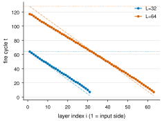

# Adaptive inference budget for PC-ALM, phase 2: per-layer freeze-and-fire

Date: 2026-09-14. Project: Augmented Lagrangian Predictive Coding (Seely and Gould, arXiv 2605.31022).
Builds on the phase-1 report (`../adaptive-budget-phase1/adaptive-budget-phase1-report.md`).
Design: `phase2-per-layer-trigger-design.md`. Code: `pcalm_layerwise` in `pcalm/inference.py`
on the phase-2 experiment branches (32 unit tests pass, including exact-reproduction tests).

## Question

Phase 1 showed that a global trigger on the composite credit `g_i = lambda_i + rho r_i` only
rediscovers a fixed budget of about 1.7L, because the credit wave reaches the input layer at a
time set by the architecture. The remaining compute is in the layers: output-side layers settle
by cycle 10 and then sit idle for 100 more cycles at L = 64. Can each layer decide its own weight
update time from its own credit, stop participating in inference once it has decided, and keep
the accuracy of the fixed `T = 2L` schedule?

## Method (freeze-and-fire)

Each hidden layer `i` tracks the relative change `d_i = ||g_i(t) - g_i(t-1)|| / ||g_i(t)||` of
its own credit. When `||g_i|| >= 1e-3` and `d_i < tau` for 3 consecutive cycles (and `t >= 2`),
the layer fires: it snapshots `G_i = g_i` for its weight update and, in mode `freeze`, stops
taking primal and dual steps. The loop ends when every layer has fired, or at `t_max = 3L`. The
weight update is the paper's update with `G_i` in place of `lambda_i + rho r_i`. Nothing in the
trigger is non-local: before the wave arrives, `h_i` equals its forward value and `lambda_i = 0`,
so `g_i` is exactly zero.

Two ablations: `fire_only` snapshots the credit at fire time but keeps every layer running
(no compute saving); `freeze_h` skips the primal step but keeps integrating `lambda_i` (built and
unit-tested, not run at scale because `freeze` did not lose accuracy).

Compute is reported as **active layer-cycles**: the number of (layer, cycle) pairs in which a
layer's primal step ran, divided by `(L-1) * 2L`, the cost of the paper's schedule. A dense JAX
implementation masks frozen layers rather than skipping them, so wall-clock does not drop; the
metric is what a sparse or event-driven implementation would realise.

Setup as in phase 1: Fashion-MNIST, ReLU residual MLP (mean-field parameterisation), the paper's
frozen `eta_h`, `rho = alpha = 1`, batch 64, one epoch, 3 seeds, cells (32, 32) and (32, 64).

## Results

**Figure 1.** Test accuracy after one epoch against active layer-cycles as a fraction of the
fixed `T = 2L` schedule. Mean of 3 seeds, error bars one standard deviation. Stars are the
layer-wise variants; the open star is the fire-only ablation.

| Cell (N, L) | Method | test acc (%) | grad cos to BP | loop length | active layer-cycles |
|---|---|---|---|---|---|
| (32, 64) | PC-ALM T=2L (paper) | 75.14 ± 0.65 | 0.924 | 2.00L | 1.000 |
| (32, 64) | PC-ALM T=L | 65.03 ± 1.69 | 0.754 | 1.00L | 0.500 |
| (32, 64) | global adaptive tau=0.1 (phase 1) | 75.28 ± 0.98 | 0.851 | 1.75L | 0.875 |
| (32, 64) | **layer-wise freeze tau=0.1** | **75.38 ± 0.65** | 0.811 | 1.83L | **0.493** |
| (32, 64) | layer-wise freeze tau=0.03 | 75.27 ± 0.64 | 0.913 | 2.10L | 0.575 |
| (32, 64) | layer-wise fire-only tau=0.1 | 75.26 ± 0.69 | 0.891 | 1.97L | 0.984 |
| (32, 32) | PC-ALM T=2L (paper) | 76.85 ± 0.78 | 0.932 | 2.00L | 1.000 |
| (32, 32) | PC-ALM T=L | 67.35 ± 1.66 | 0.720 | 1.00L | 0.500 |
| (32, 32) | global adaptive tau=0.1 (phase 1) | 76.92 ± 0.55 | 0.850 | 1.68L | 0.840 |
| (32, 32) | **layer-wise freeze tau=0.1** | **76.83 ± 0.83** | 0.890 | 2.00L | **0.562** |
| (32, 32) | layer-wise freeze tau=0.03 | 76.76 ± 0.75 | 0.942 | 2.31L | 0.671 |
| (32, 32) | layer-wise fire-only tau=0.1 | 76.83 ± 0.76 | 0.931 | 2.09L | 1.047 |

BP reaches 76.01 ± 0.83 (L = 64) and 77.63 ± 0.93 (L = 32).

### Finding 1: half the layer compute at the paper's accuracy

Freeze-and-fire at `tau = 0.1` matches PC-ALM at `T = 2L` within noise in both cells (its mean
is 0.24 points higher at L = 64 and 0.02 lower at L = 32) while running 49% (L = 64) and 56%
(L = 32) of the active layer-cycles. PC-ALM at `T = L`, the paper's own way of spending half the
compute, loses 10 points in the same cells. The global trigger from phase 1 saved 12 to 16%; the
per-layer trigger saves 44 to 51%.

### Finding 2: fire times trace the credit wave

**Figure 2.** Mean fire cycle per layer (seed 0, freeze, `tau = 0.1`) against layer index, with the
wave prediction `(L - i) / sqrt(alpha eta_h)` from the paper's Appendix D as dashed lines and
the fixed budget `t = 2L` as dotted lines.

Fire times are linear in layer index from the output side (layer L-1 fires at cycle 7) to the
input side (layer 1 fires at cycle 117 for L = 64). The fitted slope is 1.75 cycles per layer at
L = 64 and 1.84 at L = 32, against the linear-theory group velocity of 2.03 and 2.06: the same
0.86 to 0.89 ratio that phase 1 measured for the global arrival time. The area under this line
is the active layer-cycle count: a triangle of `0.5 * slope * L^2 ≈ 0.5 * 1.75 * L^2`
layer-cycles against the fixed schedule's `2 L^2`, i.e. a fraction of about 0.44, plus the
roughly 20-cycle settling width of each layer, which brings it to the measured 0.49. This is
the paper's ballistic credit propagation measured layer by layer in a ReLU network, and it is
what makes the saving predictable from `eta_h` alone.

### Finding 3: freezing, not the early snapshot, is what buys the compute, and it costs nothing

The fire-only ablation snapshots the same credit at the same time but keeps every layer running:
its accuracy equals freeze-and-fire's in both cells (75.26 vs 75.38 and 76.83 vs 76.83), so
taking each layer's credit at its own arrival time is a sound gradient. Freezing on top of that
removes half the layer-cycles and does not change accuracy either. Gradient cosine to BP does
drop when layers are frozen early (0.81 versus 0.92 at L = 64), consistent with phase 1's
observation that alignment beyond about 0.85 does not translate into accuracy after one epoch.
`tau = 0.03` buys the alignment back (0.91) at 8 points more active compute; it is the setting to
prefer if alignment itself matters.

## Caveats

- Compute is counted, not timed. A dense implementation runs frozen layers under a mask. The
  saving is real for a sparse or event-driven implementation, which is the setting the paper's
  biological-plausibility motivation implies.
- Two cells, three seeds. The main table is one epoch; the 5-epoch confirmation in the addendum
  covers freeze `tau = 0.1` only.
- The freeze mode stops integrating `lambda_i` once layer `i` fires, so a frozen layer's
  neighbour on the input side receives credit only through `rho r_i`. The results say this is
  enough, but `freeze_h` (keep integrating) exists if deeper or narrower cells disagree.
- The fire decision is shared across the batch.

## Provenance

Round-3 nodes are children of the phase-1 winner (global adaptive `tau = 0.1`, N=32 L=64,
node `251e0a59`); the phase-2 winner is node `d3be7be4`. Per-seed outputs include
`fire_times_mean.csv` under `runs/<tag>/seed<k>/`. Figure scripts: `figures/acc-vs-active.py`,
`figures/fire-times.py`.

## Addendum (round 4): 5-epoch confirmation

Freeze-and-fire at `tau = 0.1` trained for 5 epochs (3 seeds) on both cells, compared with the
round-2 5-epoch runs of PC-ALM `T = 2L` and BP. Test accuracy (mean of 3 seeds) per epoch:

| Cell | Method | active layer-cycles | ep 1 | ep 2 | ep 3 | ep 4 | ep 5 |
|---|---|---|---|---|---|---|---|
| (32, 32) | BP | - | 77.6 | 80.8 | 82.3 | 83.3 | 83.8 |
| (32, 32) | PC-ALM T=2L | 1.00 | 76.9 | 80.3 | 81.5 | 82.6 | 83.1 |
| (32, 32) | freeze-and-fire tau=0.1 | 0.56 | 76.8 | 80.3 | 81.6 | 82.6 | 83.1 |
| (32, 64) | BP | - | 76.0 | 80.1 | 81.7 | 82.7 | 83.2 |
| (32, 64) | PC-ALM T=2L | 1.00 | 75.1 | 79.0 | 80.5 | 81.4 | 82.0 |
| (32, 64) | freeze-and-fire tau=0.1 | 0.49 | 75.4 | 79.1 | 80.5 | 81.5 | 82.2 |

The layer-wise schedule tracks the fixed `T = 2L` schedule to within 0.2 points at every epoch
in both cells (final: 83.05 ± 0.13 vs 83.13 at L = 32; 82.15 ± 0.67 vs 82.02 at L = 64) while
running 56% and 49% of its active layer-cycles. The active fraction is stable over training
(0.493 at L = 64 in both the 1-epoch and 5-epoch runs), as expected from fire times set by the
architecture. The multi-epoch caveat is closed for phase 2 as well.
