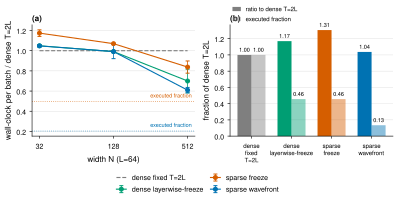

# Round 5: sparse layer-wise PC-ALM, wall-clock, and the L = 128 cell

Date: 2026-09-14. Follows the phase-2 report (`adaptive-budget-phase2-report.md`). Design:
`../../worktree docs/superpowers/specs/2026-09-14-sparse-layerwise-design.md` (also on the
GitHub branch `sparse-implementation`). Code: `run_pcalm_layerwise_sparse` and `pcalm/timing.py`;
51 unit tests pass, including exact reproduction of the dense phase-2 method in both gates.

## Questions

1. Does the phase-2 compute saving, counted as active layer-cycles, turn into wall-clock when
   frozen layers are really skipped rather than masked?
2. Layers also idle *before* the credit wave reaches them, where their gradient is exactly zero.
   How much does skipping that as well save, and is it exact?
3. Does the accuracy match and the saving hold at the paper's deepest depth, L = 128?

## Method

The primal step is rewritten layer by layer. Predictions `pred_i` are cached and refreshed only
when their input activity changed in the previous cycle; the backward term
`J_{i+1}^T c_{i+1}` is computed with `jax.vjp` of the layer's prediction map, so the residual
skip connection and the activation derivative are handled exactly. Both the forward refresh and
the backward step sit inside `jax.lax.cond`, which XLA executes as a true branch on CPU, so a
skipped layer performs no matmuls. Two gates:

- `freeze`: skip a layer once it has fired (phase-2 semantics).
- `wavefront`: additionally skip a layer while its own credit and its downstream neighbour's
  credit are exactly zero, i.e. before the wave arrives. The skipped update is identically zero,
  so this is exact; the unit tests confirm activities, fire times, and weight gradients equal
  the dense implementation to 1e-5.

Two compute metrics are reported. *Active* layer-cycles is the phase-2 definition (layer not
yet fired). *Executed* layer-cycles counts the conditionals that took the compute branch. Both
are normalised by `(L-1) * 2L`, the paper's fixed schedule.

Timing: initialised network, batch 64, one JIT-compiled call per configuration, 3 warm-up calls,
median of 20 timed calls, on an idle Apple M4 Max CPU (an earlier sweep taken while four training
runs shared the CPU is kept in `data/` for reference; ratios were similar, absolute times 20 to
30% higher).

## Results

**Figure 1.** (a) Wall-clock per batch relative to the dense fixed `T = 2L` schedule at L = 64
as width grows; dotted guides are the executed layer-cycle fractions an ideal implementation
would reach. (b) The N = 32, L = 128 cell. Medians of 20 calls, IQR error bars.

### Wall-clock (idle machine, L = 64)

| Width N | impl | ms / batch | ratio to dense 2L | executed fraction |
|---|---|---|---|---|
| 32 | dense fixed 2L | 38.2 | 1.00 | 1.00 |
| 32 | sparse wavefront | 40.0 | 1.05 | 0.21 |
| 128 | dense fixed 2L | 140.6 | 1.00 | 1.00 |
| 128 | sparse wavefront | 139.3 | 0.99 | 0.21 |
| 512 | dense fixed 2L | 1093.6 | 1.00 | 1.00 |
| 512 | dense layer-wise freeze (masked) | 765.2 | 0.70 | 0.50 |
| 512 | sparse freeze | 916.2 | 0.84 | 0.50 |
| 512 | sparse wavefront | 666.4 | 0.61 | 0.20 |

N = 32, L = 128: dense fixed 2L 146.4 ms; sparse wavefront 151.8 ms (1.04) at executed
fraction 0.13. Full table: `data/timing-idle-machine.csv`.

### Accuracy and executed compute over real training (1 epoch, 3 seeds)

| Cell | Method | test acc (%) | active | executed |
|---|---|---|---|---|
| (32, 64) | PC-ALM T=2L | 75.14 ± 0.65 | 1.00 | 1.00 |
| (32, 64) | dense freeze-and-fire tau=0.1 (phase 2) | 75.38 ± 0.65 | 0.49 | 0.49 |
| (32, 64) | sparse wavefront tau=0.1 | 75.38 ± 0.67 | 0.49 | **0.21** |
| (32, 128) | BP | 75.17 ± 0.29 | - | - |
| (32, 128) | PC-ALM T=2L | 74.31 ± 0.90 | 1.00 | 1.00 |
| (32, 128) | sparse wavefront tau=0.1 | 74.22 ± 0.77 | 0.46 | **0.13** |

## Findings

**1. The wavefront gate is exact and removes 79 to 87% of the layer compute.** At L = 64 the
sparse wavefront run reproduces the dense phase-2 winner's accuracy exactly (75.38%), as the
unit tests require, while executing 21% of the layer-cycles. At L = 128 it matches PC-ALM at
`T = 2L` within noise (74.22 vs 74.31, BP 75.17) while executing 13%. The active fraction
follows the phase-2 prediction (0.456 measured vs 0.47 predicted at L = 128). The executed
fraction is *lower* than the 0.22 I predicted from a strict one-layer-per-cycle light cone,
because the credit only becomes nonzero once the diffusive front has meaningful amplitude, so the
band in which a layer actually computes is narrower than the light cone. The saving therefore
improves with depth: 0.21 at L = 64, 0.13 at L = 128.

**2. Wall-clock follows executed compute only once matmuls dominate.** At width 512 the sparse
wavefront path runs in 0.61 of the dense schedule's time and sparse freeze in 0.84; at width 128
it breaks even; at width 32 every layer-wise variant is 5 to 30% slower than dense. The gap
between 0.61 measured and 0.20 executed is per-layer dispatch: each active layer costs two
`lax.cond` calls per cycle, around 15,000 per batch at L = 64, which is a fixed overhead that the
tiny matmuls at N = 32 cannot amortise. Two implementation routes would close most of it, and
neither changes the algorithm: fuse the forward refresh and backward step of a layer into one
conditional, or exploit the fact that the active set is always a contiguous band of layers and
slice it out with one dynamic-slice per cycle instead of one conditional per layer.

**3. The masked dense implementation is a surprisingly strong baseline on CPU.** At width 512
the phase-2 masked code runs in 0.70 of dense fixed 2L, faster than sparse freeze (0.84),
because XLA fuses the whole-network gradient into a few large kernels and the masked layers add
no dispatch. This is why the wavefront gate, not the freeze gate, is what makes real skipping
pay: it removes enough work to beat fusion.

**4. The L = 128 cell shows the widest PC-ALM to BP gap so far** (0.86 points at `T = 2L`),
and the sparse method sits on the PC-ALM side of it, not on the BP side. The layer-wise
trigger does not change what PC-ALM converges to; it changes what it costs.

## Caveats

- CPU only. GPU execution of `lax.cond` inside a scan is launch-bound at these widths and would
  need a different kernel strategy; the executed-fraction metric, not the CPU ratio, is the
  hardware-independent claim.
- Timing is at initialisation. Fire times do not depend on training state (phase 1 and 2), so
  this is representative, and the training runs confirm the executed fraction over an epoch.
- One epoch at L = 128, three seeds.

## Provenance

Experiment nodes under the phase-2 winner (`d3be7be4`): sparse implementation and timing
(`8e3f6be8`, two runs: contended then idle), sparse wavefront (32, 64) (`b8001a7c`), L = 128 BP
(`b0ebbac3`), L = 128 PC-ALM 2L (`81960abb`), L = 128 sparse wavefront (`b1beb5f9`). Figure
script `figures/wallclock-vs-width.py`; tables in `data/`.
